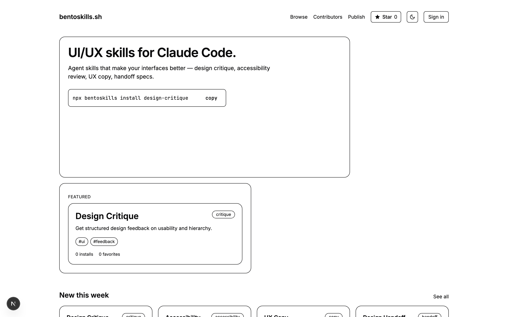
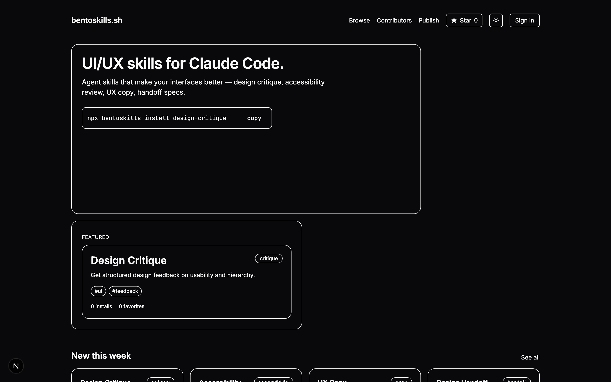
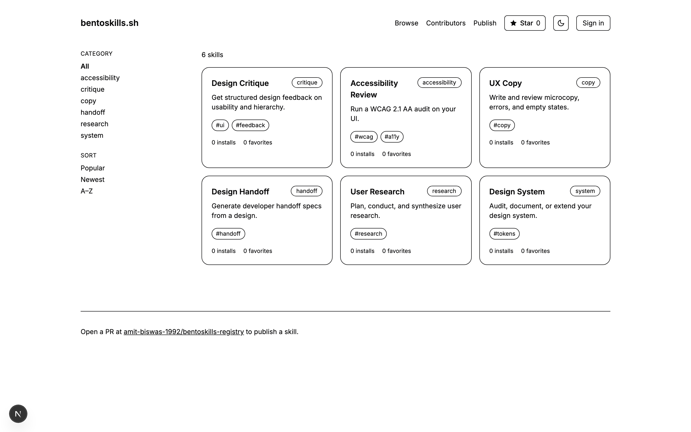
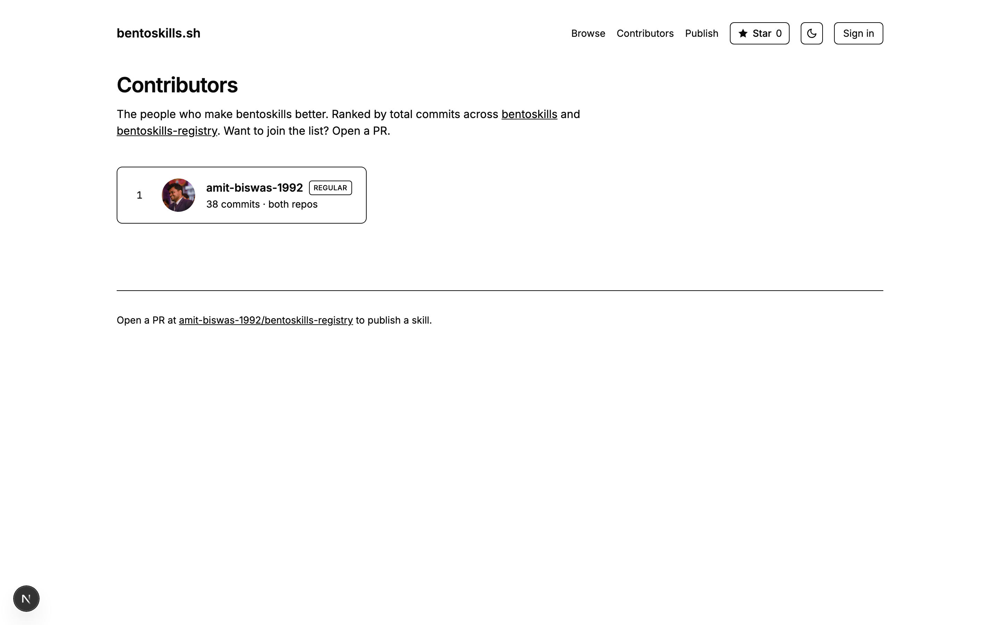

# bentoskills.sh

> A marketplace for UI/UX Claude Code agent skills — browse, install, and share curated design skills.



[](https://github.com/amit-biswas-1992/bentoskills/actions/workflows/ci.yml)
[](LICENSE)
[](./cli)

## Install a skill in one line

```bash
npx bentoskills install design-critique
```

That drops the skill into `~/.claude/skills/` and Claude Code picks it up on next launch. See [`cli/`](./cli) for all commands.

## What is BentoSkills?

BentoSkills is a consumer-focused marketplace for Claude Code agent skills that enhance UI/UX workflows. Think of it as an app store for design-oriented AI skills — backed by an open GitHub registry, so every skill is PR-reviewed and versioned.

**Built-in skill categories:**
- **Design Critique** — Get actionable feedback on your UI designs
- **Accessibility Review** — Audit components for WCAG compliance
- **UX Copy** — Generate and refine microcopy
- **Design Handoff** — Bridge the gap between design and code
- **User Research** — Structure and analyze user research
- **Design System** — Build and maintain design systems

## Screenshots

<table>
  <tr>
    <td align="center">
      <br/>
      <sub><b>Home · light</b></sub>
    </td>
    <td align="center">
      <br/>
      <sub><b>Home · dark</b></sub>
    </td>
  </tr>
  <tr>
    <td align="center">
      <br/>
      <sub><b>Browse &amp; search</b></sub>
    </td>
    <td align="center">
      <br/>
      <sub><b>Contributor leaderboard</b></sub>
    </td>
  </tr>
</table>

Also: a [15-second demo GIF](docs/demo.gif) and [MP4](docs/demo.mp4) of the install flow.

## Features

- **Browse & Search** — Postgres full-text search with GIN-indexed tsvector, category filtering, trending, and featured skills
- **Star on GitHub** — Live stargazer count in the header, cached 30 min
- **Dark mode** — Pre-hydration theme script with no FOUC, persisted in `localStorage`
- **Contributor leaderboard** — Aggregated commits across the app and registry repos, ranked with Core/Regular badges
- **`npx bentoskills install`** — Zero-dependency CLI that pulls skills directly from the registry
- **GitHub OAuth** — Sign in to favorite skills and track installs
- **GitHub-Backed Registry** — Skills live at [amit-biswas-1992/bentoskills-registry](https://github.com/amit-biswas-1992/bentoskills-registry); publishing is a pull request

## Tech Stack

| Layer | Technology |
|-------|-----------|
| Framework | Next.js 16 (App Router, RSC, Turbopack) |
| Language | TypeScript (strict) |
| Database | PostgreSQL (Supabase) + TypeORM |
| Auth | NextAuth v5 (Auth.js) + GitHub |
| Search | Postgres `tsvector` + GIN index |
| Styling | Tailwind CSS v4 + CVA |
| Testing | Vitest + Playwright |
| CI/CD | GitHub Actions + Vercel |
| Demo video | Remotion 4 |

## Getting Started

### Prerequisites

- Node.js 22 (see [`.nvmrc`](./.nvmrc))
- pnpm 9+
- PostgreSQL 16 (or a Supabase project with both pooler endpoints)
- GitHub OAuth App ([create one here](https://github.com/settings/developers))

### Setup

```bash
# Clone the repo
git clone https://github.com/amit-biswas-1992/bentoskills.git
cd bentoskills

# Install dependencies
pnpm install

# Copy env template and fill in your values
cp .env.local.example .env.local

# Run database migration (uses session pooler)
pnpm db:migrate

# Seed with starter skills
pnpm db:seed

# Start dev server (uses transaction pooler)
pnpm dev
```

Open [http://localhost:3000](http://localhost:3000) to see the app.

### Environment Variables

See [`.env.local.example`](.env.local.example) for the full list. Key variables:

| Variable | Description |
|----------|-------------|
| `DATABASE_URL` | **Transaction pooler** (port 6543) — used by the app server for short-lived concurrent queries |
| `MIGRATION_DATABASE_URL` | **Session pooler** (port 5432) — used by TypeORM migrations (requires session-scoped features) |
| `DATABASE_SSL` | Set to `true` for Supabase |
| `NEXTAUTH_SECRET` | `openssl rand -base64 32` |
| `GITHUB_ID` / `GITHUB_SECRET` | OAuth app credentials |
| `GITHUB_TOKEN` | Optional — lifts GitHub API rate limit for star count and contributor fetches |
| `GITHUB_REGISTRY_REPO` | `owner/repo` for the skill registry |
| `CRON_SECRET` | Protects the sync cron endpoint |

> **Why two database URLs?** Supabase's transaction pooler handles many concurrent app queries but doesn't support session-scoped features like advisory locks. Migrations need those, so they talk to the session pooler. This split is what keeps Next.js HMR from exhausting the session pooler's 15-client limit.

## Project Structure

```
app/
  (marketing)/          # Public pages (home, browse, skill detail, contributors, publish)
  (app)/                # Auth-gated pages (account, favorites)
  api/                  # API routes (skills, favorites, installs, cron)
cli/                    # npx bentoskills install — standalone CLI package
components/
  ui/                   # Primitives (Button, Input, Badge, Skeleton)
  skill-card.tsx        # Compact + featured skill cards
  bento-grid.tsx        # Responsive bento grid layout
  command-block.tsx     # One-click install with clipboard
  star-button.tsx       # Server component with live stargazer count
  theme-toggle.tsx      # Client component for dark/light toggle
  theme-script.tsx      # Pre-hydration theme applier (no FOUC)
demo/                   # Remotion project for the landing page demo video
docs/                   # Screenshots + demo GIF/MP4 used by this README
lib/
  db/                   # TypeORM DataSource (HMR-safe), entities, repositories
  registry/             # GitHub client, YAML parser, sync algorithm
  auth/                 # NextAuth configuration
  api/                  # Error handling utilities
scripts/
  capture-screenshots.ts  # Playwright-driven screenshot generator for the README
  seed.ts                 # Database seed
```

## Scripts

| Command | Description |
|---------|-------------|
| `pnpm dev` | Start development server |
| `pnpm build` | Production build |
| `pnpm test` | Run unit tests (Vitest) |
| `pnpm test:e2e` | Run E2E tests (Playwright) |
| `pnpm typecheck` | TypeScript type checking |
| `pnpm lint` | ESLint |
| `pnpm db:migrate` | Run TypeORM migrations |
| `pnpm db:revert` | Revert last migration |
| `pnpm db:seed` | Seed database with starter skills |
| `pnpm tsx scripts/capture-screenshots.ts` | Regenerate README screenshots |

## Contributing

### Adding a skill

Skills live in a separate repo: [amit-biswas-1992/bentoskills-registry](https://github.com/amit-biswas-1992/bentoskills-registry). Open a PR there with a new `skills/<slug>/skill.yaml` + `README.md` and the sync job will pick it up.

### Working on the app

1. Fork the repository
2. Create a feature branch (`git checkout -b feat/amazing-feature`)
3. Run `pnpm test` and `pnpm typecheck` before committing
4. Open a Pull Request

## License

[MIT](LICENSE) — built with care by [Amit Biswas](https://github.com/amit-biswas-1992).
